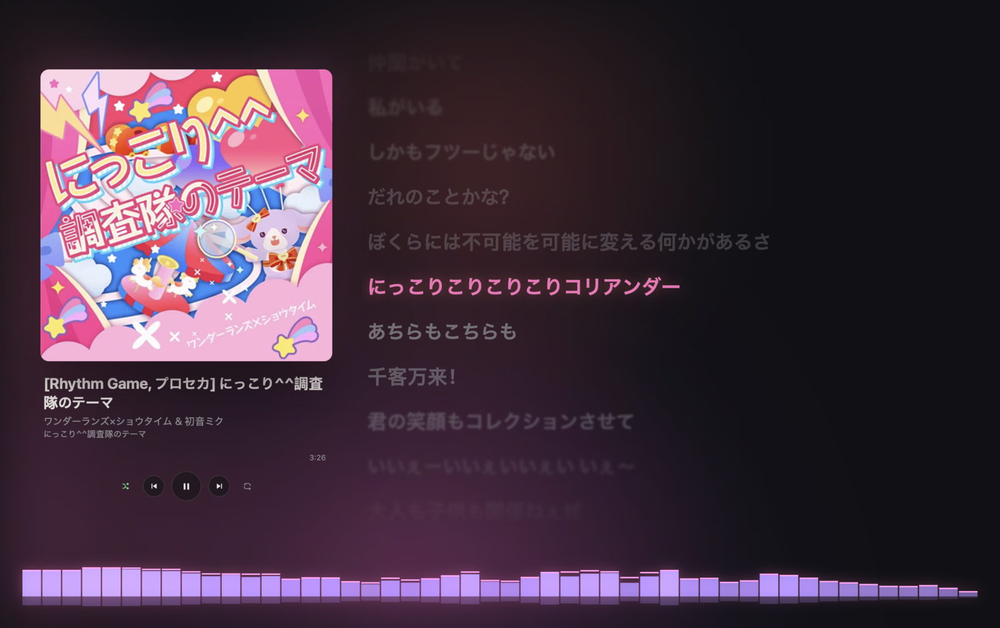
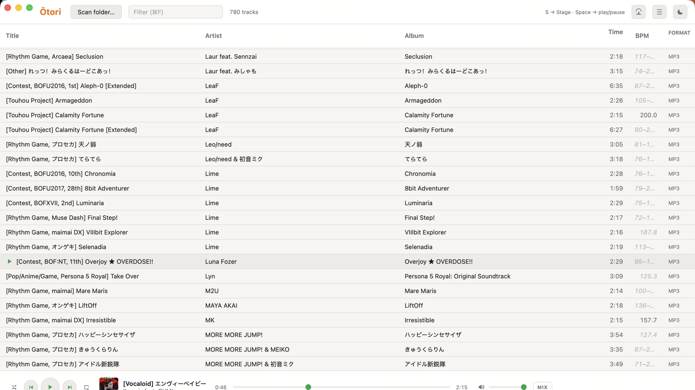

<div align="center">


# Ōtori

**The final stop for your local music files.**

Organize · Enjoy · Delegate — one library, with stage presence.

[](LICENSE)


</div>

Everything you collect — doujin albums, BMS contest tracks, Vocaloid
releases, rips — gets organized into one clean, trustworthy library,
then enjoyed in a player with stage presence. And the organizing itself
can be delegated to an AI agent, *safely*.

Named after 鳳 (ōtori, the phoenix). Also reads as 音鳥 — the bird of
sound.

> Pre-alpha (v0.1.0). macOS is the primary platform; Windows (x86_64)
> is supported as of this port. APIs, schemas, and UI are all still
> moving — expect breaking changes; the 1.0 bar lives in
> [CONTRIBUTING.md](CONTRIBUTING.md) § "Reaching 1.0".

## Why another music player?

Every existing tool makes you choose: organize *or* enjoy *or*
automate.

|  | Manages tags | Performs | Agent-operable |
|---|:---:|:---:|:---:|
| Swinsian | ✅ | ❌ | ❌ |
| Music.app | ⚠️ hostile to files | ✅ | ❌ |
| Mp3tag | ✅ | ❌ doesn't play | ❌ |
| Plexamp | ❌ read-only tags | ✅ | ❌ |
| **Ōtori** | **✅** | **✅** | **✅ with a trust stack** |

Ōtori's three promises:

1. **Organize** — Swinsian-grade tag management over your actual files,
   with a personal-curation-aware safety model.
2. **Enjoy** — a Stage mode with live spectrum analysis tuned for
   electronic music, and karaoke-grade synced lyrics where data exists.
3. **Delegate** — the entire feature surface is agent-operable through
   a CLI contract, and delegation is psychologically viable because the
   safety model makes your curated work untouchable by default.

## What works today

- **Playback with stage presence** — two-deck gapless engine,
  beat-matched DJ crossfades between tempo-compatible tracks, live
  48-bar spectrum (log-frequency, dB-scaled, peak-hold, 60fps).
- **Stage / Backstage dual-mode UI** — one keystroke between a dense
  management table and a performance surface with cover-art gel
  lighting, beat-reactive visuals, and synced scrolling lyrics.
- **Library index** — iCloud-aware scan into a SQLite index;
  multi-format releases (mp3/flac/alac) linked as one logical track.
- **Tag editing under a trust stack** — provenance on every field,
  dry-run diffs, journaled undo, first-touch snapshots.
- **BPM you can trust** — a built-in classical-DSP detector owns the
  BPM column; external values (TBPM tags, provider data) are treated
  as hints that get verified, never blindly copied. Variable-tempo
  tracks get honest ranges.
- **Lyrics & artwork** — LRCLIB synced-lyrics fetch, VocaDB jacket and
  BPM lookup, journaled cover embedding — all with the same
  provenance rules.
- **A real CLI** — everything above is scriptable through the `otori`
  binary.

<div align="center">

<br><em>Stage — pressing play starts a show.</em>
<br><br>

<br><em>Backstage — information density wins.</em>
</div>

## The two structural bets

### Agent-native, with a trust stack

Most "agent-friendly" tools stop at machine-readable output. Ōtori
commits to a five-layer contract (interface / safety / observability /
discoverability / coexistence — see [docs/PRODUCT.md](docs/PRODUCT.md)),
and the safety layer is the moat:

- **Provenance, first-class**: every tag field records its source —
  `human` > `agent` > `import` > `inferred`. Human-curated fields are
  untouchable by agents unless you explicitly override.
- **Dry-run by default**: destructive operations print a structured
  diff; `--apply` is the flag, not the default.
- **Journal + first-touch snapshot**: every applied batch is an
  undoable transaction, and a file's original tags are snapshotted
  before Ōtori's first-ever write to it.

*Provenance before, dry-run during, undo after.* Restoring after damage
is weaker than being untouchable.

### Stage / Backstage dual-mode UI

Managing a library and enjoying it are different postures:

- **Backstage** — dense tables, batch tag editing, filters. Information
  density wins.
- **Stage** — large art, real-time spectrum bars, synced scrolling
  lyrics, minimal chrome. Immersion wins.

One keystroke switches. Managing feels like Swinsian; pressing play
starts a show.

## Architecture

```
otori/
├── crates/
│   ├── otori-core/   # engine room: library index (SQLite), tag r/w, lyrics, BPM (Rust)
│   └── otori-cli/    # `otori` binary — the agent-facing surface (Rust)
├── src-tauri/        # desktop shell: thin IPC glue over otori-core (Rust)
└── src/              # everything you see: UI, playback, spectrum, lyrics (TypeScript)
```

Two consumers, one core. The GUI (for humans) and the CLI (for agents
and scripts) are both thin layers over `otori-core`; anything one can
do, the other can do. The CLI is the *only* agent surface — agents that
speak shell already speak Ōtori.

### CLI contract

- `--json` on every subcommand, stable versioned schemas
- destructive operations are dry-run by default and print the diff
  first; `--apply` makes it real
- semantic exit codes (0 ok / 2 partial / 3 bad input / 4 corrupt
  library); structured errors on stderr
- the SQLite index schema is documented and open for reads; writes go
  through the CLI only

What delegation looks like in practice:

```console
$ otori set track.mp3 --artist "サカナクション" --agent tagger --apply
skipped: field 'artist' is human-curated (--override-curated to force)

$ otori fetch-lyrics track.mp3            # dry-run: shows the LRCLIB match
$ otori fetch-lyrics track.mp3 --apply    # journaled write, undoable
$ otori undo <tx-id>                      # ...and back
```

Pointing an agent at Ōtori? [AGENTS.md](AGENTS.md) is the operating
contract.

## Building from source

Prerequisites: [Rust](https://rustup.rs/) (stable), Node.js +
[pnpm](https://pnpm.io/), and the
[Tauri 2 system dependencies](https://v2.tauri.app/start/prerequisites/).

```bash
pnpm install
pnpm tauri dev                          # desktop app
cargo run -p otori-cli -- tags <file>   # CLI
pnpm tauri build --bundles app          # package .app
```

Stack: Tauri 2 · Rust (lofty, rusqlite) · Vite · React 19 · TypeScript.

## Roadmap (MVP cuts)

1. **It plays** — iCloud-aware scan → SQLite index *with the provenance
   schema from day one* → track list → playback + live spectrum. ✅
2. **It organizes** — tag read/write, `otori curate`, dry-run diffs,
   journal/undo, first-touch snapshots. CLI reaches parity with GUI
   editing. ✅
3. **It performs** — Stage mode, LRC parsing + scroll, word-level
   lyrics where data exists. Smart playlists, watch folders. ◐

Non-goals for 1.0: streaming integration, recommendations, multi-device
sync, downloading, DRM decryption.

## Installing the pre-alpha build

Pre-built macOS binaries ship on the GitHub Releases page (arm64 `.dmg`).
They are **unsigned**: macOS Gatekeeper blocks an unnotarized download on
first open. To run it, either right-click → *Open*, or strip the
quarantine flag once:

```bash
xattr -dr com.apple.quarantine /Applications/Ōtori.app
```

A signed + notarized build (Developer ID, ~$99/yr) is deferred until the
1.0 bar is near; see [CONTRIBUTING.md](CONTRIBUTING.md) § "Reaching 1.0".
Building from source below needs no signing at all. A Windows (x86_64)
`.msi`/`.exe` build is produced by CI from this same source; the Windows
binary is also unsigned, so SmartScreen warns on first run — click
*More info → Run anyway*.

## Contributing

Contributions are welcome — see [CONTRIBUTING.md](CONTRIBUTING.md) for
the dev setup, test conventions, and what makes a good first PR. The
design SSOT lives in [docs/PRODUCT.md](docs/PRODUCT.md); reading it
first will save you a round-trip.

## Sponsoring

If Ōtori is useful to you and you'd like to support its development,
you can sponsor via the links in the GitHub sidebar. Sponsorship funds
development time; it does not buy roadmap priority — the
[non-goals](#roadmap-mvp-cuts) stay non-goals.

## License

Ōtori is free software, licensed under the
[GNU Affero General Public License v3.0](LICENSE) (AGPL-3.0-only).

In short: you may use, study, modify, and redistribute it, but any
distributed or network-hosted derivative must publish its source under
the same license. If you need different terms, open an issue to talk.

## Design docs

- [docs/PRODUCT.md](docs/PRODUCT.md) — what we build and why (the
  design SSOT)
- [docs/adr/](docs/adr/) — architecture decision records
- [AGENTS.md](AGENTS.md) — the agent operating contract
